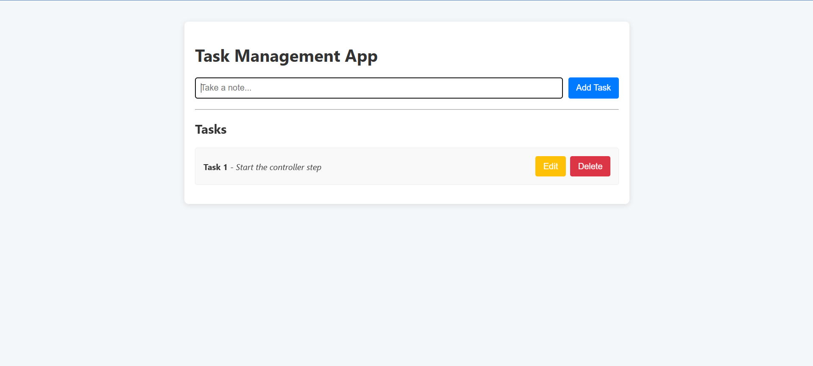

# 📝 Full-Stack Task Management App

A modern, responsive task management application built with the Spring Boot and React stack. This project demonstrates a complete full-stack development cycle, from a RESTful API backend to a dynamic, interactive frontend.




---

## ✨ Features

- **Full CRUD Functionality:** Create, Read, Update, and Delete tasks.
- **Dynamic Frontend:** A single-page application (SPA) built with React that updates the UI instantly without page reloads.
- **Expandable Form UI:** A modern, Google Keep-style form that expands on focus for a clean user experience.
- **RESTful API:** A robust backend API built with Spring Boot providing clear and predictable endpoints.
- **Organized Codebase:** Clear separation of concerns between the frontend and backend projects.

---

## 🛠️ Tech Stack

### Backend
- **Java 17**
- **Spring Boot 3**
- **Spring Data JPA / Hibernate**
- **H2 In-Memory Database**
- **Maven**

### Frontend
- **React 18**
- **JavaScript (ES6+)**
- **Axios** (for API requests)
- **CSS3**

---

## 🚀 Getting Started

To get a local copy up and running, follow these simple steps.

### Prerequisites

- JDK 17 or later
- Maven 3.2+
- Node.js 14.x or later
- npm

### Installation & Setup

1.  **Clone the repository:**
    ```sh
    git clone [https://github.com/your-username/fullstack-task-management-app.git](https://github.com/your-username/fullstack-task-management-app.git)
    cd fullstack-task-management-app
    ```

2.  **Run the Backend:**
    - Navigate to the backend directory:
      ```sh
      cd task-management
      ```
    - Run the Spring Boot application using Maven:
      ```sh
      mvn spring-boot:run
      ```
    - The backend will be running on `http://localhost:8080`.

3.  **Run the Frontend:**
    - Open a new terminal window and navigate to the frontend directory:
      ```sh
      cd task-management-ui
      ```
    - Install NPM packages:
      ```sh
      npm install
      ```
    - Start the React development server:
      ```sh
      npm start
      ```
    - Open [http://localhost:3000](http://localhost:3000) to view it in your browser.

---

## 🧠 What I Learned

This project was a deep dive into full-stack development and solidified my understanding of:

-   Building and structuring a RESTful API from scratch with Spring Boot.
-   Managing component state and side effects in React using hooks (`useState`, `useEffect`).
-   Connecting a frontend application to a backend API, including handling CORS issues.
-   Implementing the complete CRUD lifecycle in a real-world application.
-   Debugging common issues between the client and server, such as API contract mismatches.
-   The importance of clean, component-based architecture in React.

---

## 🌟 Future Improvements

- [ ] Implement user authentication and authorization with Spring Security and JWT.
- [ ] Allow users to change the status of tasks (e.g., Pending, In Progress, Completed).
- [ ] Replace the H2 database with a persistent database like PostgreSQL.
- [ ] Deploy the application to a cloud service like Heroku or AWS.
